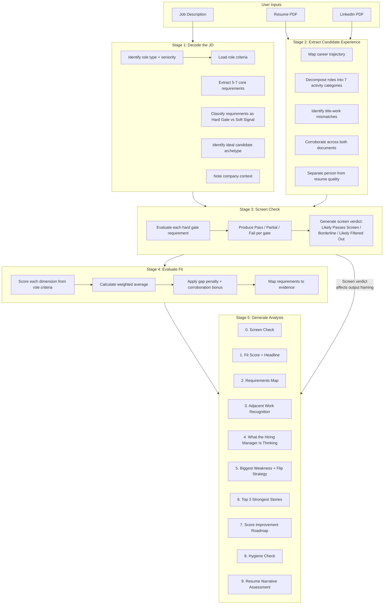
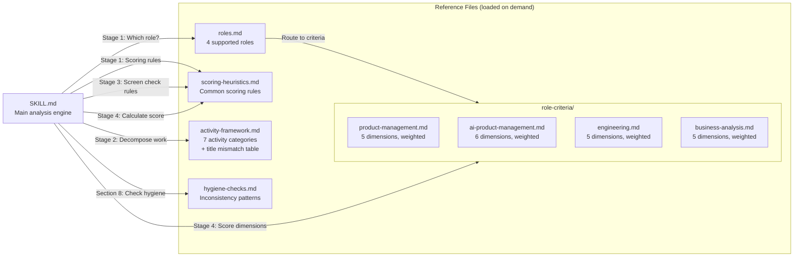
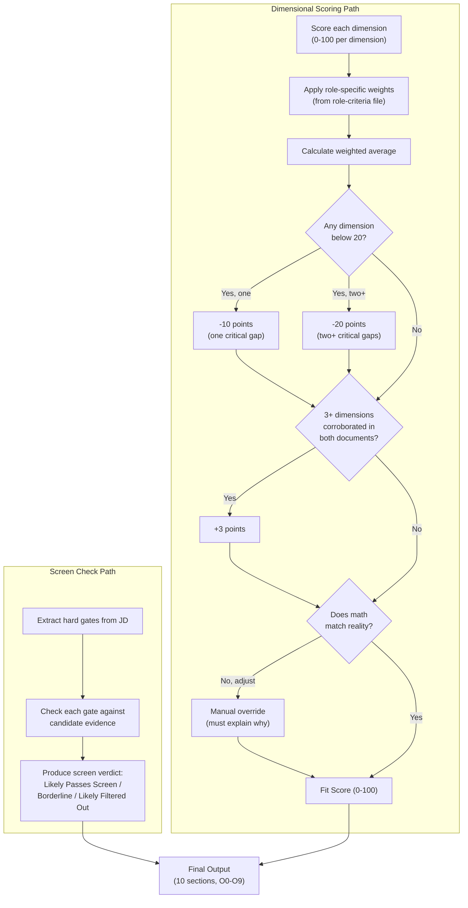

# Architecture

## Skill Component Flow



## Reference File Dependencies



## Scoring Calculation Flow



## File Structure

```
job-fit-analyzer/
├── skill/                           # THE SKILL (upload this folder)
│   ├── SKILL.md                     # Main engine. 5-stage analysis flow.
│   └── references/                  # Loaded on demand, not at startup
│       ├── roles.md                 # Role routing: which criteria file to use
│       ├── scoring-heuristics.md    # Common rules: recency, depth, corroboration
│       ├── activity-framework.md    # 7 activity categories + title mismatch table
│       ├── hygiene-checks.md        # LinkedIn vs resume check patterns
│       └── role-criteria/           # Per-role scoring dimensions and weights
│           ├── product-management.md
│           ├── ai-product-management.md
│           ├── engineering.md
│           └── business-analysis.md
├── examples/
│   ├── sample-jd.txt               # Example job description input
│   └── sample-output.md            # Full 10-section analysis output
├── ARCHITECTURE.md                  # This file
├── CLAUDE.md                        # Writing style rules
├── README.md                        # Project overview and setup
├── LICENSE                          # MIT
├── plan.md                          # Original project plan
└── .gitignore
```

## Key Design Decisions

**Three-level loading.** SKILL.md info (name + blurb) loads at session start. SKILL.md body loads when the skill runs. Reference files load only when needed. This keeps context use low.

**Role routing.** Stage 1 finds the role type, then loads only the right criteria file. A PM run never loads eng criteria. This keeps each run focused and stops role rules from mixing.

**Scoring split.** The scoring rules (shared) and role criteria (per-role) live in their own files. Shared rules rarely change. Role criteria grow as we get more test data. Keeping them apart means you can update PM scoring and not touch the shared rules.

**Resume quality is kept apart from fit.** The fit score comes from Stage 4 (area scoring). The resume review is a stand-alone output in Stage 5. A bad resume does not lower the fit score. This was a clear product choice: judge the person, not just their doc.

**Two-layer check.** The screen check runs before area scoring. This mirrors how hiring really works. Hard gate needs (tools, platforms, domains, certs) get a Pass/Partial/Fail grade. The screen verdict tells people if they would clear first-pass filters. The fit score then shows how they would do if screened in. This stops the tool from giving false hope with a high fit score when a person would be auto-cut on a missing need. No other job-match tool does this. They all make one blended score that can hide key gaps.
