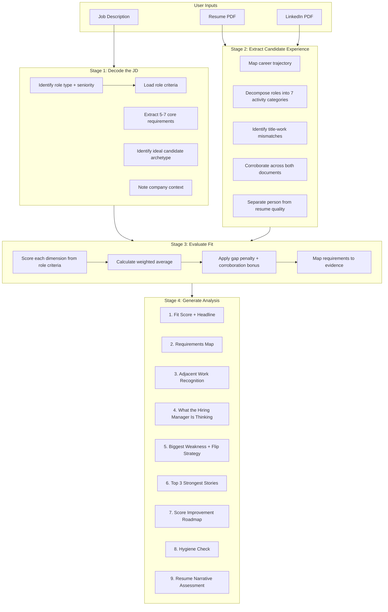
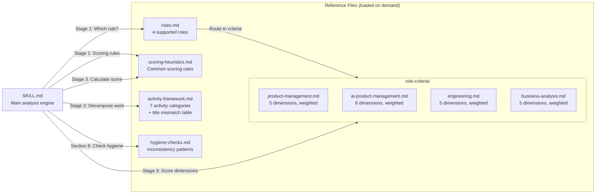
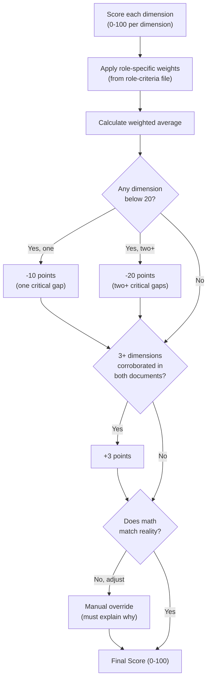

# Architecture

## Skill Component Flow



## Reference File Dependencies



## Scoring Calculation Flow



## File Structure

```
job-fit-analyzer/
├── job-fit-analyzer/                # THE SKILL (upload this folder as ZIP)
│   ├── SKILL.md                     # Main engine. 4-stage analysis flow.
│   └── references/                  # Loaded on demand, not at startup
│       ├── roles.md                 # Role routing: which criteria file to use
│       ├── scoring-heuristics.md    # Common rules: recency, depth, corroboration
│       ├── activity-framework.md    # 7 activity categories + title mismatch table
│       ├── hygiene-checks.md        # LinkedIn vs resume check patterns
│       └── role-criteria/           # Per-role scoring dimensions and weights
│           ├── product-management.md
│           ├── ai-product-management.md
│           ├── engineering.md
│           └── business-analysis.md
├── examples/
│   ├── sample-jd.txt               # Example job description input
│   └── sample-output.md            # Full 9-section analysis output
├── ARCHITECTURE.md                  # This file
├── CLAUDE.md                        # Writing style rules
├── README.md                        # Project overview and setup
├── LICENSE                          # MIT
├── plan.md                          # Original project plan
└── .gitignore
```

## Key Design Decisions

**Three-level loading.** SKILL.md metadata (name + description) loads at session start. SKILL.md body loads when the skill triggers. Reference files load only when needed during analysis. This keeps context usage efficient.

**Role routing.** Stage 1 identifies the role type, then loads only the relevant criteria file. A PM analysis never loads engineering criteria. This keeps each analysis focused and prevents cross-contamination between role evaluation patterns.

**Scoring separation.** The scoring heuristics (common rules) and role criteria (specific dimensions) are in separate files. Common rules change rarely. Role criteria evolve as we get more calibration data. Keeping them apart means you can update PM scoring without touching the shared rules.

**Resume quality is decoupled from fit.** The fit score comes from Stage 3 (dimension scoring). The resume narrative assessment is a separate output in Stage 4. A bad resume doesn't lower the fit score. This was a deliberate product decision to evaluate the person, not just their document.
